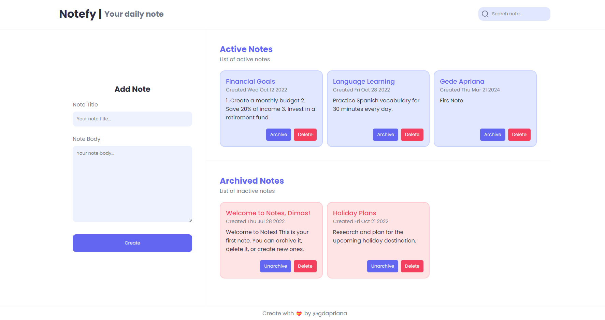

## Submission: Membangun Notes App

| Field | Information |
|---|---|
| Student Name | I KOMANG GEDE APRIANA (gedeapriana) |
| Submission ID | 2961493 |
| Course | [Belajar Fundamental Front-End Web Development](https://www.dicoding.com/academies/163) |
| Dikirim pada | 	21-Mar-2024 14:19:16 |
| Submission | [Submission: Membangun Notes App](https://www.dicoding.com/academies/315/tutorials/16849) |
| Tipe | Token: SIB Cycle 6 Cohort - FEBE |
| Stars |  |

Anda telah belajar hal-hal berikut.

- Membangun formulir dengan baik dan benar.
- Penyusunan layouting dengan CSS Grid Layout.
- Membangun komponen UI dengan Web Component.

Semua modul ini menjadi kebutuhan kita dalam menjadi front-end web developer yang andal. Tidak serta merta Anda dinyatakan lulus atau paham seluruh materi di atas. Untuk mengujinya, kami akan melakukan asesmen dengan memberikan tugas kepada Anda untuk membangun aplikasi web. Nantinya, reviewer kami akan memeriksa pekerjaan Anda dan memberikan hasil reviu pada proyek yang dibuat.

## Kriteria
- [x] Menampilkan Daftar Catatan dengan Baik
- [x] Formulir Tambah Catatan
- [x] CSS Grid sebagai Metode Layouting
- [x] Bangun Komponen UI dengan Web Component

## Kriteria Opsional
- [x] memiliki tampilan yang menarik.
- [x] menerapkan realtime validation pada formulir.
- [x] menerapkan custom attribute pada custom element.
- [x] memiliki tampilan yang responsive.
