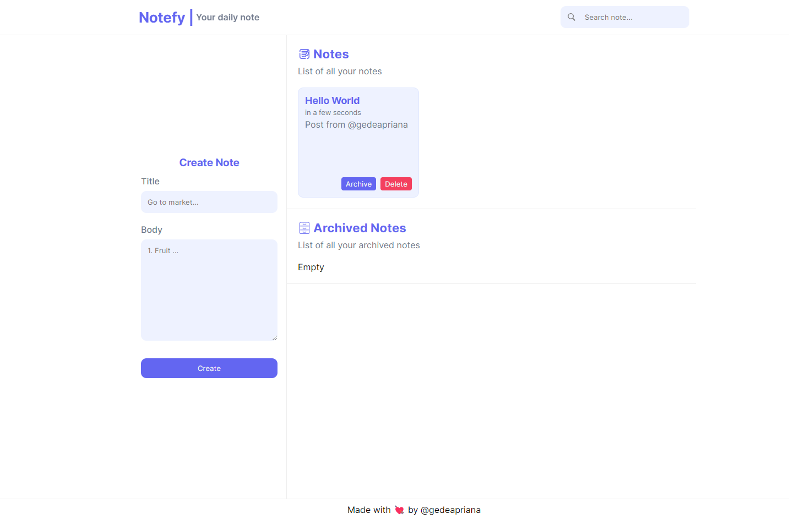

## Submission: Integrasi Notes App dengan RESTful API

| Field | Information |
|---|---|
| Student Name | I KOMANG GEDE APRIANA (gedeapriana) |
| Submission ID | 2974160 |
| Course | [Belajar Fundamental Front-End Web Development](https://www.dicoding.com/academies/163) |
| Dikirim pada | 26-Mar-2024 01:37:48 |
| Submission | [Submission: Membangun Notes App](https://www.dicoding.com/academies/315/tutorials/16849) |
| Tipe | Token: SIB Cycle 6 Cohort - FEBE |
| Stars |  |

Anda telah belajar hal-hal berikut.

- Pengelolaan JavaScript packages dengan package manager.
- Melakukan bundel terhadap seluruh kode-kode JavaScript dengan module bundler.
- Mendapatkan data dari penyedia data secara daring menggunakan teknik Asynchronous JavaScript Request.

Semua modul ini menjadi kebutuhan kita dalam menjadi front-end web developer yang andal. Tidak serta merta Anda dinyatakan lulus atau paham seluruh materi di atas. Untuk mengujinya, kami akan melakukan asesmen dengan memberikan tugas kepada Anda untuk membangun kembali aplikasi web yang telah dibangun sebelumnya. Nantinya, reviewer kami akan memeriksa pekerjaan Anda dan memberikan hasil reviu pada proyek yang dibuat.

## Kriteria
- [x] Pertahankan Kriteria Submission Sebelumnya
- [x] Memanfaatkan RESTful API sebagai Sumber Data
- [x] Menggunakan webpack sebagai Module Bundler
- [x] Menggunakan Fetch API
- [x] Memiliki Indikator Loading

## Kriteria Opsional
- [x] Memiliki Fitur Arsip Catatan
- [x] Menampilkan Feedback Saat Terjadi Error
- [x] Memiliki Efek Pergerakan Halus atau Animasi
- [x] Menerapkan Prettier sebagai Code Formatter
